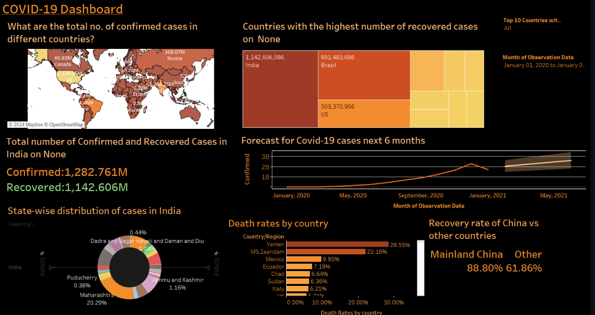

# Data Visualization with Tableau
  

## Road Accidents Dashboard

This dashboard provides an overview of road accident statistics for the year 2022 compared to 2019. It includes:

- Total accidents and casualties with year-over-year changes
- Breakdown of accidents by vehicle type
- Fatal casualties by weather conditions and road type
- Geographic distribution of accidents
- Detailed breakdown of fatal casualties by road type

Key features:
- Interactive filters for year, accident severity, and district area
- Trend lines showing monthly data
- Color-coded metrics indicating increases or decreases

## COVID-19 Dashboard

This dashboard visualizes global COVID-19 data, focusing on:

- World map of confirmed cases by country
- Top countries with the highest number of recovered cases
- Detailed statistics for India
- 6-month forecast of COVID-19 cases
- State-wise distribution of cases in India
- Death rates by country
- Recovery rate comparison between China and other countries

Key features:
- Time range selector from January 2020 onwards
- Country/region filters
- Combination of map, bar charts, and line graphs for comprehensive data representation

## Usage

To view these dashboards:
1. Install Tableau Desktop or Tableau Reader
2. Download the data source and open it in Tableau
3. Open the respective .twb files in the repository

